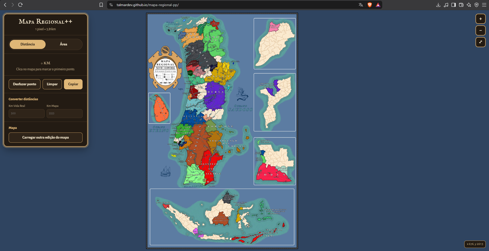
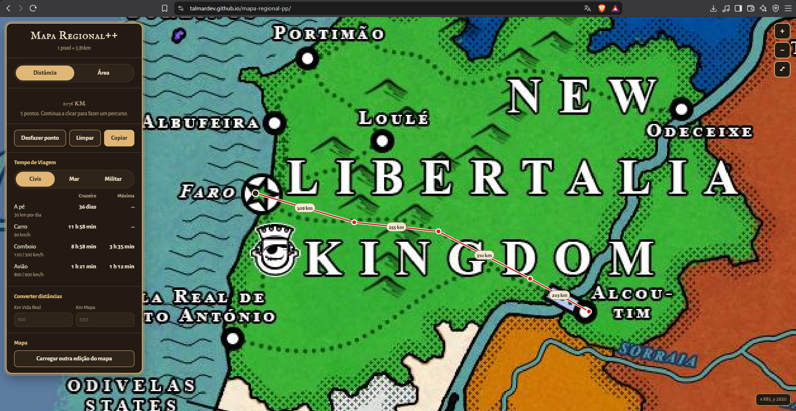
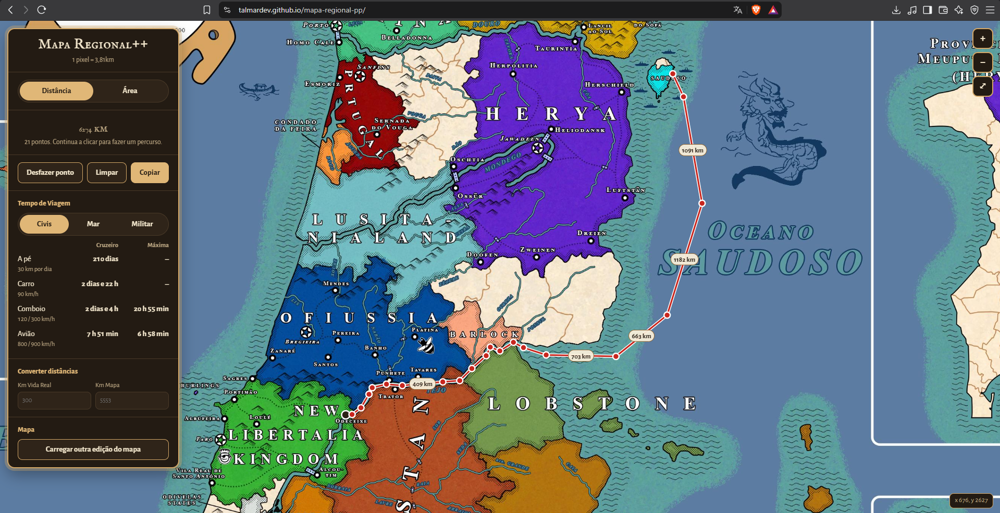
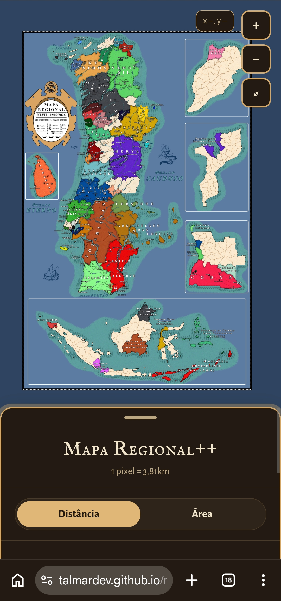
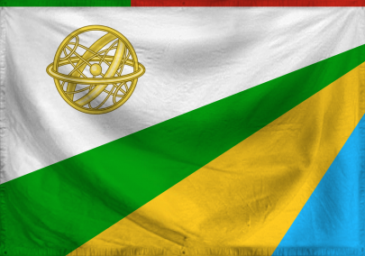
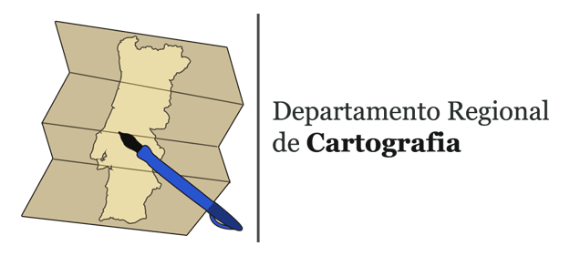

# Mapa Regional++

Ferramenta para medir distâncias, áreas e tempos de viagem no Mapa Regional, no navegador do computador ou do telemóvel.

**[Abrir o Mapa Regional++](https://talmardev.github.io/mapa-regional-pp/)**

## Como usar

### Medir uma distância

1. No painel, escolhe **Distância** (já vem escolhida).
2. Clica no mapa para marcar o primeiro ponto.
3. Continua a clicar para fazer um percurso com os pontos que quiseres.

O total aparece no painel e os km de cada troço aparecem nas etiquetas do mapa. Com dois pontos ou mais aparece também o **Tempo de Viagem**, com os meios divididos em **Civis**, **Mar** e **Militar**, cada um com a velocidade de cruzeiro e a máxima.

### Viagens por mar

No grupo **Mar**, marca o percurso pela água com vários pontos, a contornar a costa. Se um troço atravessar terra, o painel avisa e esse troço fica a tracejado laranja no mapa.

### Medir uma área

Escolhe **Área** e marca pelo menos 3 pontos à volta da zona. O painel mostra a área em km² e o perímetro.

### Corrigir e partilhar

- **Arrasta um ponto** para o mudar de sítio.
- **Desfazer ponto** tira o último ponto (também com Backspace ou Ctrl+Z).
- **Limpar** apaga tudo (também com Esc).
- **Copiar** copia o resultado em texto, pronto a colar no Discord, por exemplo `Distância: 1090 km (7 troços)`.

### Andar pelo mapa

- Roda do rato para aproximar e afastar, arrastar para mover.
- Botões no canto superior direito: aproximar (+), afastar (−) e ver o mapa todo (⤢).
- O canto inferior direito mostra as coordenadas do cursor, em píxeis do mapa.

### Caixas à parte

Taprobana, Marrocos, Moçambique, Angola e Indonésia têm a mesma escala do continente, mas não se mede entre zonas diferentes: o primeiro ponto define a zona e os pontos marcados noutra são recusados com um aviso.

### Converter distâncias

Escreve os km da vida real em **Km Vida Real** para ver quanto são no mapa, ou ao contrário em **Km Mapa**.

### No telemóvel

Funciona da mesma forma: toca para marcar pontos, usa dois dedos para aproximar e arrasta a pega no topo do painel para o subir ou descer.

### Ver outra edição do mapa

**Carregar outra edição do mapa**, no fim do painel, abre uma imagem do mapa guardada no teu dispositivo, por exemplo uma edição antiga. Só muda o que tu vês: o site continua igual para os outros.

## Secção técnica

HTML, CSS e JavaScript puro, sem dependências nem compilação, feito para o GitHub Pages.

- `index.html`: estrutura da página e modelo da notificação dos créditos.
- `style.css`: aspeto da página, incluindo a versão para telemóvel.
- `config.js`: tudo o que pode mudar (escalas, dimensões do mapa, caixas, velocidades, cor do mar e créditos).
- `app.js`: mapa, medições, tempos de viagem, conversor e créditos.
- `media/`: o mapa e todas as imagens do site.

### Escalas

Métricas oficiais do grupo:

- **Distância:** píxeis × 3,81 km.
- **Área:** píxeis² × 14,52 km². As áreas têm escala própria, não se usa 3,81².
- **Conversor:** 1 km da vida real = 18,51 km do mapa (medido em Portugal e na Galiza).
- **Referência:** o continente português (Portugal, Ilhas, Galiza e Cabo Verde e São Tomé ajustados) tem 123 081 km² reais, que no mapa são 42 189 120 km², a área da América.

### Atualizar o mapa numa edição nova

1. Põe o novo ficheiro com o nome `mapa` na pasta `media/` e apaga o antigo. Pode ser `jpg`, `jpeg`, `png`, `webp`, `avif` ou `jfif`; se houver mais do que um, o site usa o primeiro desta lista.
2. Se o tamanho ou a disposição do mapa mudarem, atualiza `larguraOriginal`, `alturaOriginal` e `caixas` no `config.js`.

### Licença

O código tem licença [MIT](LICENSE). A licença cobre só o código: o mapa, as bandeiras e o logo pertencem aos respetivos autores.

## Créditos

<table align="center"><tr><td align="center" width="513">
&nbsp;&nbsp;
 
<a href="https://www.nationstates.net/page=dispatch/id=861852"><picture><source media="(prefers-color-scheme: dark)" srcset="media/drcartogarifa_escuro.png"></picture></a>

Esta ferramenta foi desenvolvida por <a href="https://www.nationstates.net/nation=new_libertalia_kingdom"><b>New Libertalia Kingdom</b></a> com base no mapa mantido pelo nosso querido cartógrafo regional <a href="https://www.nationstates.net/nation=alentejo_and_algarve"><b>Alentejo and Algarve</b></a>.

</td></tr></table>
